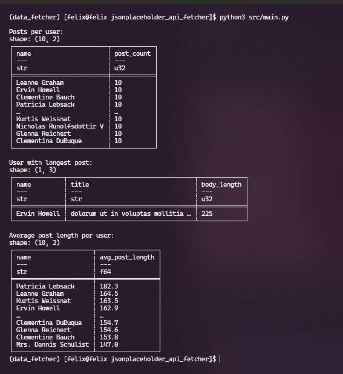

## Fetching data from the JSONPlaceholder API

The code contained in this repository fetches data from the JSONPlaceholder API, formats it using Pydantic models, and then stores it as a Delta table.

Once data is stored locally, it is queried using Polars.

### Installation

Clone the repository
```bash
git clone https://github.com/fvgm-spec/jsonplaceholder_api_fetcher.git
```

Install dependencies
```bash
pip3 install -r requirements.txt
```

### Step 1: Fetch data from the /posts and /users endpoints

```python
## data_fetcher.py

async def fetch_data(endpoint: str) -> dict:
    base_url = "https://jsonplaceholder.typicode.com"
    async with httpx.AsyncClient() as client:
        response = await client.get(f"{base_url}/{endpoint}")
        response.raise_for_status()
        return response.json()

async def fetch_all_data():
    tasks = [
        fetch_data("users"),
        fetch_data("posts")
    ]
    users_data, posts_data = await asyncio.gather(*tasks)
```

### Step 2: Data vlidation using Pydantic models

```python
## models.py

from pydantic import BaseModel, Field
from typing import List

class User(BaseModel):
    id: int
    name: str
    username: str
    email: str
    
class Post(BaseModel):
    id: int
    userId: int
    title: str
    body: str
```

### Step 3: Storing the validated data in Delta tables

In order to save the fetched data into local storage is used the [delta_manager.py](https://github.com/fvgm-spec/jsonplaceholder_api_fetcher/blob/main/src/delta_manager.py) file in the *src* directory

```python
## delta_manager.py

import polars as pl
from pathlib import Path

class DeltaManager:
    def __init__(self, base_path: str = "./delta_tables"):
        self.base_path = Path(base_path)
        self.base_path.mkdir(exist_ok=True)
    
    def save_to_delta(self, data: list, table_name: str):
        df = pl.DataFrame([d.dict() for d in data])
        table_path = self.base_path / table_name
        
        df.write_delta(str(table_path))
```

Once in your terminal, you just need to run the `main.py` module as follows:

```bash
 python3 src/main.py
 ```

After the data is stored locally (as shown in the image below) in the directory `delta_tables`, by running the *main.py* module all the analysis will be performed and data will be validated using the defined models.

<p>
<div class="column">
    
  </div>
</p>


### Step 4: Querying Delta tables

By executing the `main.py`, will be answered these questions:


#### o Number of posts per user.

```python
## analysys.py
def analyze_data(delta_manager: DeltaManager):
    posts_df = delta_manager.read_delta("posts")
    users_df = delta_manager.read_delta("users")
    
    ## Number of posts per user
    posts_per_user = (
        posts_df.lazy()
        .groupby("userId")
        .agg(pl.count("id").alias("post_count"))
        .join(
            users_df.lazy().select(["id", "name"]),
            left_on="userId",
            right_on="id"
        )
        .select(["name", "post_count"])
        .collect()
    )
```

#### o The user who has written the longest post (by body length).

```python
## analysys.py
    
    ...
    ## User with longest post
    longest_post = (
        posts_df.lazy()
        .with_columns(pl.col("body").str.lengths().alias("body_length"))
        .join(
            users_df.lazy().select(["id", "name"]),
            left_on="userId",
            right_on="id"
        )
        .select(["name", "title", "body_length"])
        .sort("body_length", descending=True)
        .limit(1)
        .collect()
    )
```


#### o Average post lenght per user.

```python
## analysys.py
    
    ...
    ## Average post length per user
    avg_post_length = (
        posts_df.lazy()
        .with_columns(pl.col("body").str.lengths().alias("body_length"))
        .groupby("userId")
        .agg(
            pl.mean("body_length").alias("avg_post_length")
        )
        .join(
            users_df.lazy().select(["id", "name"]),
            left_on="userId",
            right_on="id"
        )
        .select(["name", "avg_post_length"])
        .sort("avg_post_length", descending=True)
        .collect()
    )
```


<p>
<div class="column">
    
  </div>
</p>

### Design Choices

#### Project Structure:

* Modular design with separate files for different concerns
* Clear separation between data models, data fetching, storage, and analysis
* Async operations for efficient data fetching


#### Technology Choices:

* httpx: Modern async HTTP client for Python
* Pydantic: Data validation and settings management
* Polars: Fast DataFrame library with good Delta Lake support
* delta-sharing: For Delta Lake table management
* asyncio: For asynchronous operations


#### Data Pipeline:

* Asynchronous data fetching from multiple endpoints
* Strong data validation using Pydantic models
* Efficient storage using Delta format
* Lazy evaluation in Polars for optimized query performance


### Key Components

#### Models ([models.py](https://github.com/fvgm-spec/jsonplaceholder_api_fetcher/blob/main/src/models.py)):

* Pydantic models for data validation
* Clear schema definition for both Users and Posts


#### Data Fetcher ([data_fetcher.py](https://github.com/fvgm-spec/jsonplaceholder_api_fetcher/blob/main/src/data_fetcher.py)):

* Async data fetching using httpx
* Concurrent fetching of users and posts
* Built-in error handling and validation


#### Delta Manager ([delta_manager.py](https://github.com/fvgm-spec/jsonplaceholder_api_fetcher/blob/main/src/delta_manager.py)):

* Abstraction for Delta table operations
* Handles both reading and writing operations
* Path management for local storage


#### Analysis ([analysis.py](https://github.com/fvgm-spec/jsonplaceholder_api_fetcher/blob/main/src/analysis.py)):

* Query implementations using Polars
* Lazy evaluation for better performance
* Join operations between users and posts


### Queries Implemented

#### Number of posts per user:

* Groups posts by user
* Joins with user data for readable output
* Returns user names with post counts


#### User with longest post:

* Calculates body length for each post
* Finds maximum length post
* Returns user name and post details


#### Average post length per user (additional query):

* Calculates average post length per user
* Orders users by average post length
* Provides insights into user engagement